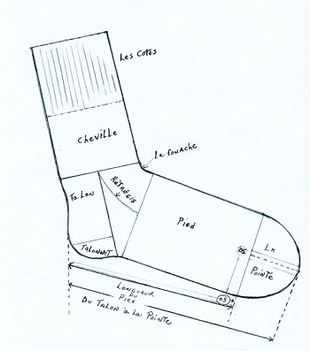

Chaussette WSGI Server
======================

**Chaussette** is a dead-simple WSGI server that can run against already opened
sockets. The main use case is to delegate the processes and sockets management
to `Circus <http://circus.io>`_.

Usage
-----

**Chaussette** provides a console script you can launch against a WSGI
application, like any WSGI server out there::

    $ chaussette myapp
    Application is <function myapp at 0x104d97668>
    Serving on localhost:8080
    Using <class chaussette.backend._wsgiref.ChaussetteServer at 0x104e58d50> as a backend

**Chaussette** has a specific mode to run against an existing open socket.
This can only be used when Chaussette is forked from another process that has created
the socket::

    $ chaussette --fd 12 myapp
    Application is <function myapp at 0x104d97668>
    Serving on fd://12
    Using <class chaussette.backend._wsgiref.ChaussetteServer at 0x104e58d50> as a backend

Running in Circus
-----------------

The typical use case is to run Chaussette processes in `Circus <http://circus.io>`_,
which takes care of binding the sockets and spawning Chaussette processes.

To run your WSGI application using Circus, define a *socket* section in your
configuration file, then add a Chaussette watcher.

Minimal example::

    [circus]
    endpoint = tcp://127.0.0.1:5555
    pubsub_endpoint = tcp://127.0.0.1:5556
    stats_endpoint = tcp://127.0.0.1:5557

    [watcher:web]
    cmd = chaussette --fd ${socket:web} --backend meinheld server.app
    use_sockets = True
    numprocesses = 5

    [socket:web]
    host = 0.0.0.0
    port = 8000

When Circus runs, it binds a socket on the *8000* port and passes the file descriptor
value to the Chaussette process, by replacing *${socket:web}* by the file number value.

Backends
--------

Chaussette is just a bit of glue code on the top of existing WSGI servers,
and is organized around **back ends**.

By default Chaussette uses a pure Python implementation based on **waitress**,
but it also provides more efficient back ends:

- **waitress** -- a backend based on stdlib's asyncore
- **gevent** -- based on Gevent's *pywsgi* server
- **fastgevent** -- based on Gevent's *wsgi* server -- faster but does not
  support streaming.
- **meinheld** -- based on Meinheld's fast C server
- **wsgiref** -- based on stdlib's wsgiref package -- not for production use.

You can select your backend by using the **--backend** option and providing
its name.

If you want to add your favorite WSGI Server as a backend to Chaussette,
send me an e-mail !

Rationale and Design
--------------------

Most WGSI servers out there provide advanced features to scale your web
applications, like multi-threading or multi-processing. Depending on the
project, the *process management* features, like respawning processes that
die, or adding new ones on the fly, are not always very advanced.

On the other hand, Circus provides very advanced features to manage
your processes, and is able to manage sockets as well.

The goal of *Chaussette* is to delegate process and socket management to
Circus and just focus on serving requests.

Using a pre-fork model, Circus binds sockets and forks Chaussette processes
that are able to accept connections on those sockets, as child processes.

For more information about this design, read http://blog.ziade.org/2012/06/12/shared-sockets-in-circus.

Useful links
------------

- Repository : https://github.com/tarekziade/chaussette

